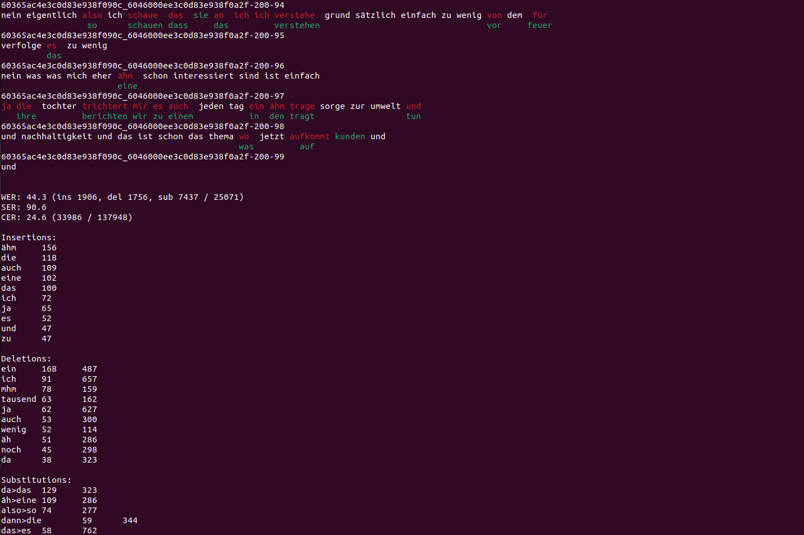

# texterrors  
  
For calculating WER, CER, other metrics, getting detailed statistics and comparing outputs. 

Meant to replace older tools like `sclite` by being easy to use, modify and extend.    
  
Features:
- Character aware, standard (default) and ctm based alignment
- Metrics by group (for example speaker)
- Comparing two hypothesis files to reference
- Oracle WER
- Sorting most common errors by frequency or count
- Measuring performance on keywords
- Measuring OOV-CER (see [https://arxiv.org/abs/2107.08091](https://arxiv.org/abs/2107.08091) )
- Colored output to inspect errors

Example of colored output below (use `-c` flag). Read the white and green words to read the reference. Read the white and red words to read the hypothesis.  

   

See here for [background motivation](https://ruabraun.github.io/jekyll/update/2020/11/27/On-word-error-rates.html).  


# Installing  
Requires minimum python 3.6!  
```
pip install texterrors
```
The package will be installed as `texterrors` and there will be a `texterrors` script in your path.  

# Example

The `-s` option means there will be no detailed output. Below `ref` and `hyp` are files with the first field equalling the utterance ID (therefore the `isark` flag).  
```
$ texterrors -isark -s ref hyp  
WER: 83.33 (ins 1, del 1, sub 3 / 6)  
```  
  
You can specify an output file to save the results, probably what you want if you are getting detailed output (not using `-s`). 
Here we are also calculating the CER, the OOV-CER to measure the performance on the OOV words inside the `oov_list` file, and using
colored output (therefore the `-c` flag).
```  
$ texterrors -c -isark -cer -oov-list-f oov_list ref hyp detailed_wer_output  
```  
**Use `less -R` to view the colored output. Skip the `-c` flag to not use color.**

Check `texterrors/__init__.py` to see functions that you may be interested in using from python. 

# Options you might want to use
Call `texterrors -h` to see all options.  
  
`-cer`, `-isctm` - Calculate CER, Use ctms for alignment

`-utt-group-map` - Should be a file which maps uttids to group, WER will be output per group (could use  
to get per speaker WER for example).  

`-second-hyp-f` - Use to compare the outputs of two different models to the reference.
  
`-freq-sort` - Sort errors by frequency rather than count
  
`-oov-list-f` - The CER between words aligned to the OOV words will be calculated (the OOV-CER).   
  
`-keywords-list-f` - Will calculate precision & recall of words in the file.

`-oracle-wer` - Hypothesis file should have multiple entries for each utterance, oracle WER will be calculated.
  
# Why is the WER slightly higher than in kaldi if I use `-use_chardiff`?
  
**You can make it equal by not using the `-use_chardiff` argument.**

This difference is because this tool can do character aware alignment. Across a normal sized test set this should result in a small difference.
  
In the below example a normal WER calculation would do a one-to-one mapping and arrive at a WER of 66.67\%.  
  
| test | sentence | okay    | words | ending | now |  
|------|----------|---------|-------|--------|-----|  
| test | a        | sentenc | ok    | endin  | now |  
  
But character aware alignment would result in the following alignment:  
  
| test | - | sentence | okay | words | ending | now |  
|------|---|----------|------|-------|--------|-----|  
| test | a | sentenc  | ok   | -     | endin  | now |  
  
This results in a WER of 83.3\% because of the extra insertion and deletion. And I think one could argue this is the actually correct WER.

# Changelog

Recent changes:  

- 22.06.22 refactored internals to make them simpler, character aware alignment is off by default, added more explanations
- 20.05.22 fixed bug missing regex dependency
- 16.05.22 fixed bug causing wrong detailed output when there is utterance with empty reference, and utts with empty reference are not ignored
- 21.04.22 insertion errors on lower line and switching colors so green is reference
- 27.01.22 oracle WER and small bug fixes
- 26.01.22 fixed bug causing OOV-CER feature to not work
- 22.11.21 new feature to compare two outputs to reference; lots of small changes 
- 04.10.21 fixed bug, nocolor option, refactoring, keywords feature works properly, updated README
- 22.08.21 added oracle wer feature, cost matrix creation returns cost now  
- 16.07.21 improves alignment based on ctms (much stricter now).  

TODO: use nanobind
