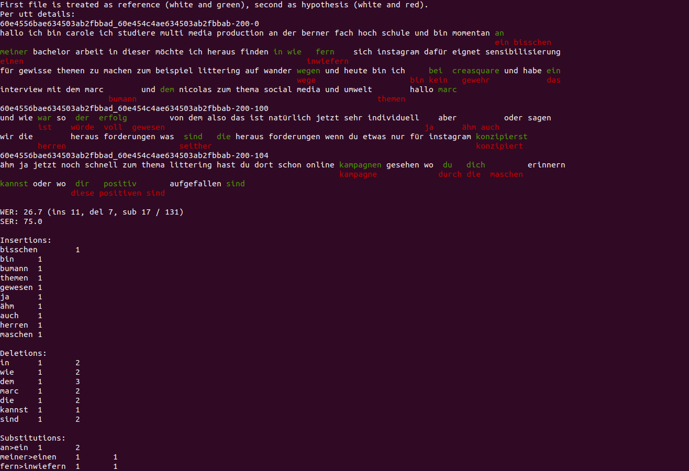

# texterrors  
  
For calculating WER, CER, other metrics, getting detailed statistics and comparing outputs. 

Meant to replace older tools like `sclite` by being easy to use, modify and extend.    
  
Features:
- Character aware (default), standard and ctm based alignment
- Metrics by group (for example speaker)
- Comparing two hypothesis files to reference
- Oracle WER
- Sorting most common errors by frequency or count
- Measuring performance on keywords
- Measuring OOV-CER (see [https://arxiv.org/abs/2107.08091](https://arxiv.org/abs/2107.08091) )
- Fancy colored output to inspect errors (example below)! (optional)

Red is what the model missed (deletion or the reference word in substitution error). Read the white and red words to read the reference.  
  
Green is what the model output incorrectly (insertion or the hypothesis word in substitution error). Read the white and green words to read the hypothesis.  
  
   

See here for [background motivation](https://ruabraun.github.io/jekyll/update/2020/11/27/On-word-error-rates.html).  

  
# Installing  
Requires minimum python 3.6! And the `pybind11` package should already be installed.  
```  
git clone --recurse-submodules git@github.com:RuABraun/texterrors.git  
python -m pip install texterrors/  
```  
The package will be installed as `texterrors`.  
  
# Example  
  
The `texterrors.py` file will be in your path after running pip install.  
  
The `-s` option means there will be no detailed output. Below `ref` and `hyp` are files with the first field equalling the utterance ID.  
```  
$ texterrors.py -isark -s ref hyp  
WER: 83.33 (ins 1, del 1, sub 3 / 6)  
```  
  
You can specify an output file to save the results, probably what you if you are getting detailed output.  
```  
$ texterrors.py -isark -cer -oov-list-f oov_list ref hyp detailed_wer_output  
```  
**Use `less -R` to view the colored output. You can use `-nocolor` to disable the coloring.**

Check `texterrors/__init__.py` to see the functions that you can may be interested in using from python. 

# Options you might want to use
There are more options, call with `-h` to see.  
  
`-cer`, `-isctm`

`-utt-group-map` - Should be a file which maps uttids to group, WER will be output per group (could use  
to get per speaker WER for example).  
  
`-freq-sort` - Sort errors by frequency rather than count
  
`-oov-list-f` - The CER between words aligned to the OOV words will be calculated (the OOV-CER).   
  
`-keywords-list-f` - Will calculate precision & recall of words in the file.

`-oracle-wer` - Hypothesis file should have multiple entries for each utterance, oracle WER will be calculated.
  
# Why is the WER slightly higher than in kaldi ?  
  
**You can make it equal by using the `-no-chardiff` argument.**  
  
This difference is because this tool does character aware alignment. Across a normal sized test set this should result in a small difference.   
  
In the below example a normal WER calculation would do a one-to-one mapping and arrive at a WER of 66.67\%.  
  
| test | sentence | okay    | words | ending | now |  
|------|----------|---------|-------|--------|-----|  
| test | a        | sentenc | ok    | endin  | now |  
  
But character aware alignment would result in the following alignment:  
  
| test | - | sentence | okay | words | ending | now |  
|------|---|----------|------|-------|--------|-----|  
| test | a | sentenc  | ok   | -     | endin  | now |  
  
This results in a WER of 83.3\% because of the extra insertion and deletion. And I think one could argue this is the actually correct WER.

# Changelog

Recent changes:  
  
- 04.10. fixed bug, nocolor option, refactoring, keywords feature works properly, updated README
- 22.08. added oracle wer feature, cost matrix creation returns cost now  
- 16.07. improves alignment based on ctms (much stricter now).  
